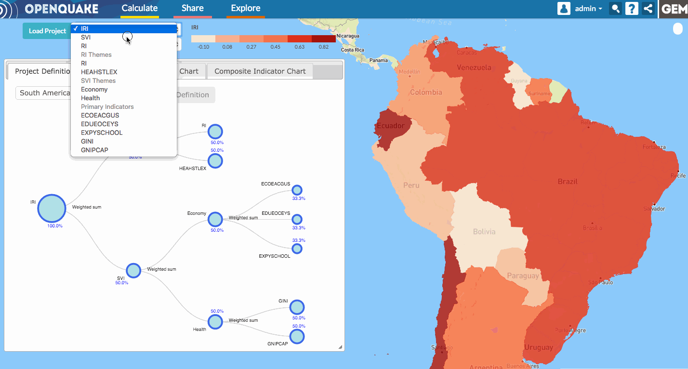
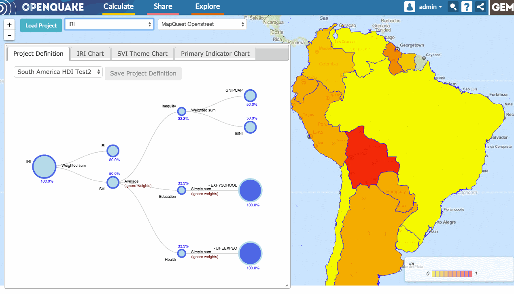

The thematic map
================

The thematic map is by default set to render the Integrated Risk Index (IRI)
values, but, if a IRI value is not available in the project, it will default to
SVI or IR values. If the user chooses to visualize other components of the
Integrated Risk Index, such as theme or primary indicators, the map can be
changed by selecting the desired item from the dropdown menu shown in the
screen-casts below.

By default the IRV web application will render the map and map layers using
`WebGL <https://www.khronos.org/webgl/>`_ technology.  However if you are using
an internet browser that does not support webGL, the application will
automaticly switch to non-webGL mode.
:numref:`fig-thematic-map-webgl` shows how the tool works
when WebGL is enabled in the browser; :numref:`fig-thematic-map-no-webgl`
when it is not. In the former case, by clicking on any region in the map, its
respective complete set of attribute information is displayed in an information
box. In the latter case, hovering the mouse over each region, the region name
and the value of the selected attribute are shown.

.. _fig-thematic-map-webgl:

    Thematic map when WebGL is enabled

.. _fig-thematic-map-no-webgl:

    Thematic map when WebGL is disabled
