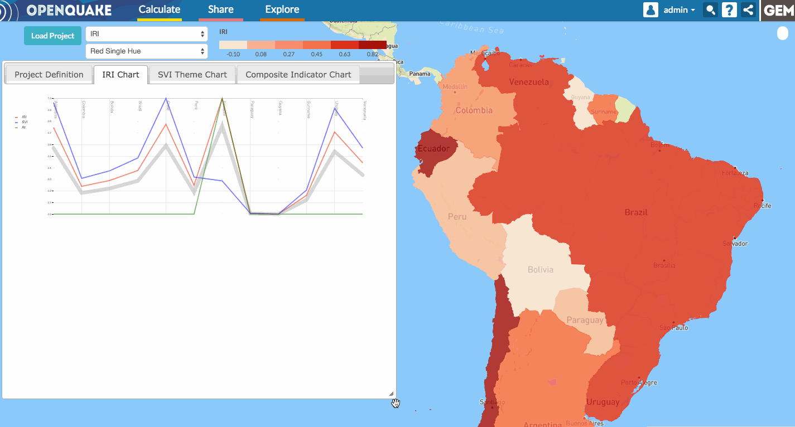

The charts
==========

Each time a weight is modified, the charts will render the new values into the
IRI, SVI and Primary Indicator charts. These charts can be viewed by clicking
on the respective tabs. The dialog can be moved and resized for a better view.

.. FIXME now charts are in separate widgets instead of tabs (we need to change also the screencast)

.. _fig-charts:

