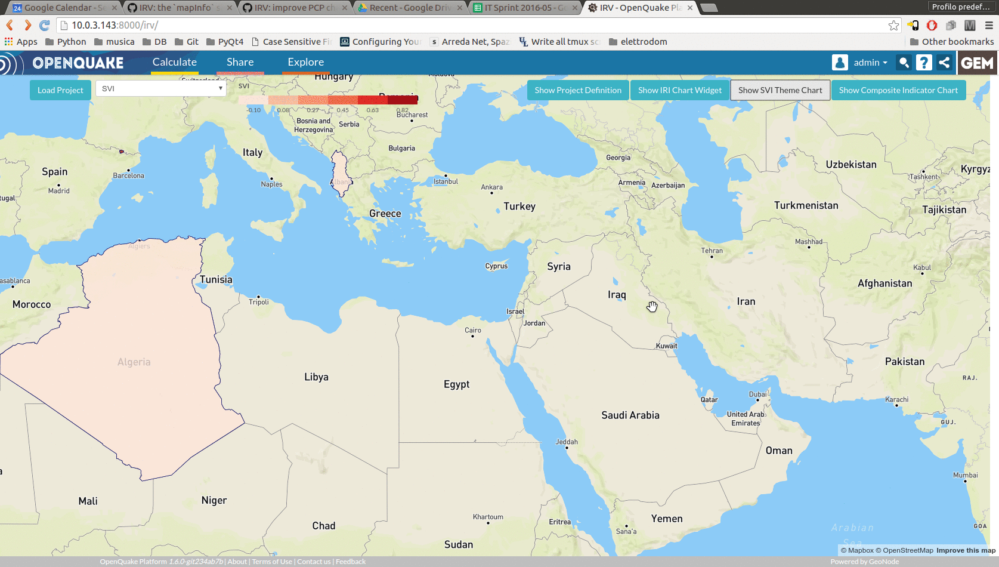
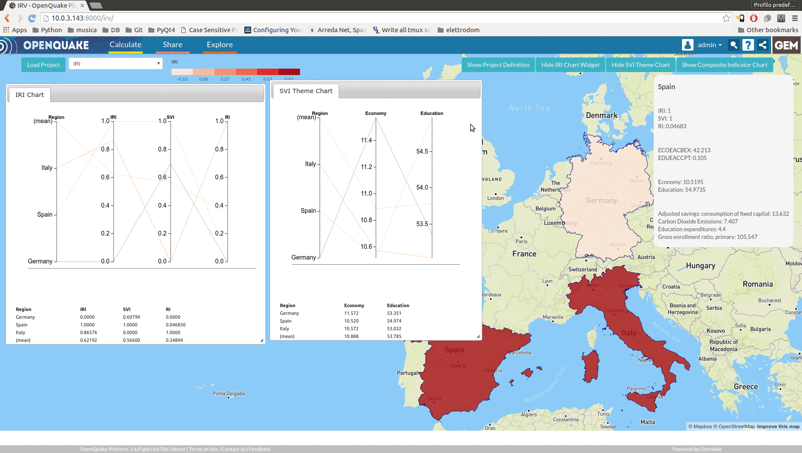

The charts
==========

Each time a weight is modified, the charts will render the new values into the
IRI, SVI and Primary Indicator charts. These charts can be viewed by clicking
on the respective buttons. Each dialog can be moved and resized for a better view.

The data is displayed as parallel coordinates charts. The first vertical axis
contains the regions taken into account by the project. When more than one region
is considered, also the mean values between all the regions are reported in the chart.
The other vertical axes
represent the values of indicators or composite indicators. Axes can be manually
ordered by the user by clicking on one axis and moving that axis horizontally
(see :numref:`fig-charts`).

.. _fig-charts:

Data can be filtered by clicking on one axis and vertically selecting a range of
values. The filtering can be further refined by setting ranges on multiple axes.
By a single click on an axis, the filtering for that axis is removed.

A horizontal line displayed at the bottom of the chart divides the valid values
from the missing ones.

In the lower part of the widget, a table shows the filtered values (or a subset
of them, if too many regions are selected). By hovering the mouse over any of the
rows, the corresponding line is highlighted in the chart.

.. _fig-interactive-charts:

Clicking a region in the map toggles the highlighting of the corresponding lines
in the charts (it causes them to be highlighted if they were not, or vice versa, it
unhighlights them if they were highlighted).
Charts are mutually dependent, so the selection of a set of regions in any of the
charts produces the same selection in the others (see :numref:`fig-interactive-charts`).
