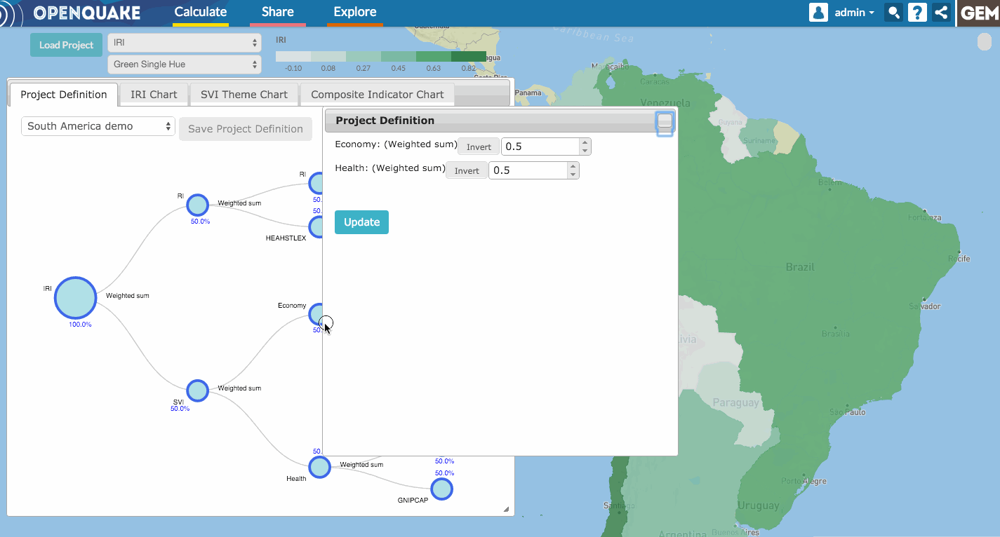

Saving a project definition
===========================

Once you make any change to a project definition, you can save such changes by
clicking on the "Save Project Definition" button. This button will become
active only when a change has been made to the project definition tree. A
dialog will open, and will require you to provide a name for the new version of
the project definition. Please note that the current project definition will
not be overwritten. Instead, a new copy will be created. You will also need to
confirm that you have read and agree to the license conditions. Then simply
click "save". The project definition is then saved back into the OpenQuake
Platform and will be accessible via the Integrated Risk Modelling Toolkit.

.. _fig-saving-project-definition:

