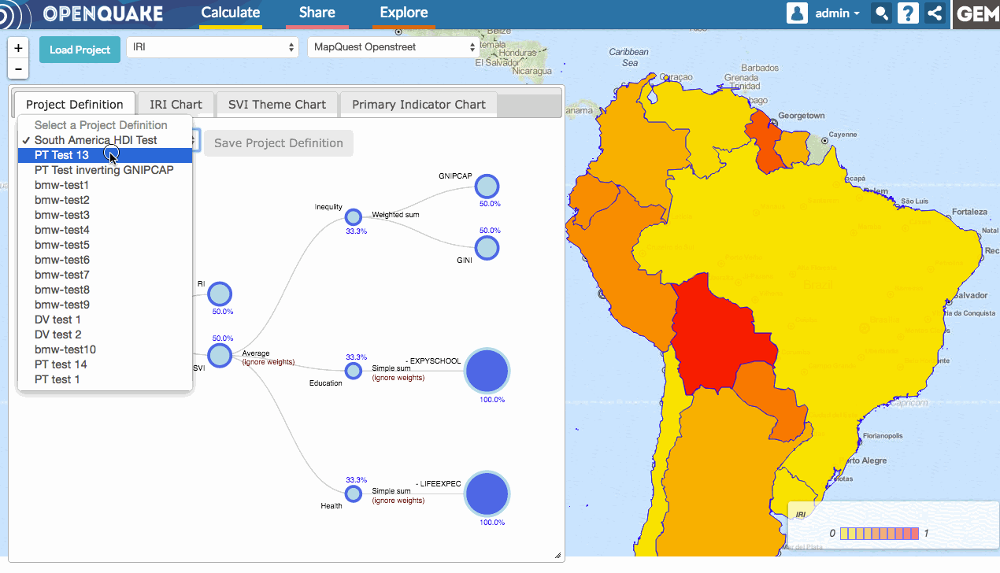

Access saved project definitions
================================

Project definitions that have been modified and saved into the OpenQuake
platform can be accessed at any time in the IRV application. To access one,
simply load a project, and then select a project definition from the "Select a
Project Definition" dropdown menu.

.. _fig-load-project-definition:

